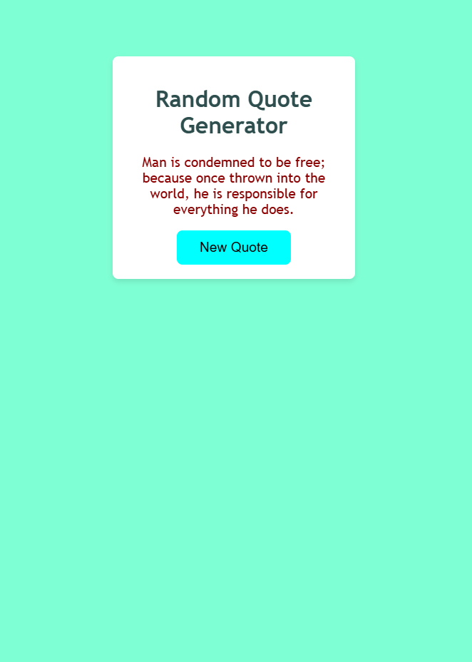

# Random Quote Generator

This is a simple Random Quote Generator project built with HTML, CSS, and JavaScript. The application displays a random quote each time the user clicks the "New Quote" button. It’s a great beginner project to practice basic web development skills and JavaScript functions.

## Demo


## Features
- Displays a random quote from a predefined list.
- Simple and clean UI.
- Responsive design with CSS styling.

## Project Structure
- `html.html` - The main HTML file that structures the page layout.
- `rps.css` - The CSS file that styles the quote generator layout, including button and container styling.
- `script.js` - The JavaScript file that contains the functionality to display a random quote when the button is clicked.

## Technologies Used
- **HTML**: Structure the webpage.
- **CSS**: Style the appearance of the quote generator.
- **JavaScript**: Randomly select and display a new quote when requested.

## How to Use
1. Clone the repository:
    ```bash
    git clone https://github.com/arg-rgb/random-quote-generator.git
    ```
2. Navigate to the project directory:
    ```bash
    cd random-quote-generator
    ```
3. Open the `html.html` file in your browser to see the Random Quote Generator in action.

## Code Explanation
- **HTML**: Contains a button that, when clicked, triggers the `getQuotes()` function to display a new quote.
- **CSS**: The container, button, and text are styled to look clean and centered on the page.
- **JavaScript**: The `getQuotes` function generates a random number, which it uses to select a quote from an array. The selected quote is then displayed in the `<p id="quote">` tag.

## Future Improvements
- Add a feature to save or share quotes.
- Fetch quotes from an external API to have a larger variety.

## Screenshot
To view a screenshot of the project, open `Capture.PNG` or view it in the project repository.

## License
This project is open-source and available under the MIT License.
